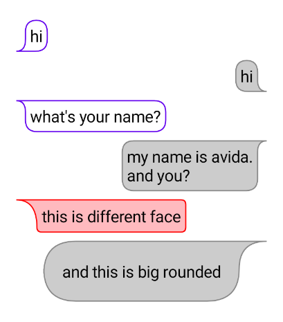

# ChatBubble module




## Installation
in your app.gradle

```groovy  

implementation project(':chatBubble')  

```  

## Basic Usage

```kotlin
@Preview
@Composable
fun ChatBubblePreview() {
    Column(
        Modifier
            .background(MainTheme.colors.questionBackground)
            .padding(vertical = 16.dp)) {
        ChatBubble(
            modifier = Modifier,
            backGroundColor = MainTheme.colors.whiteFlexible,
            borderColor = MainTheme.colors.border,
            isLeft = true
        ) {
            Text(
                text = "hi i am avida  and this is chat",
                style = MainTheme.typography.subtitle1,
                modifier = Modifier.align(Alignment.CenterStart)
            )
        }

        ChatBubble(
            modifier = Modifier,
            backGroundColor = MainTheme.colors.whiteFlexible,
            borderColor = MainTheme.colors.systemColorBlue,
            isLeft = false
        ) {
            Text(
                text = "hi i am avida  and this is chat",
                style = MainTheme.typography.subtitle1,
                modifier = Modifier.align(Alignment.CenterStart)
            )
        }
    }

}
```